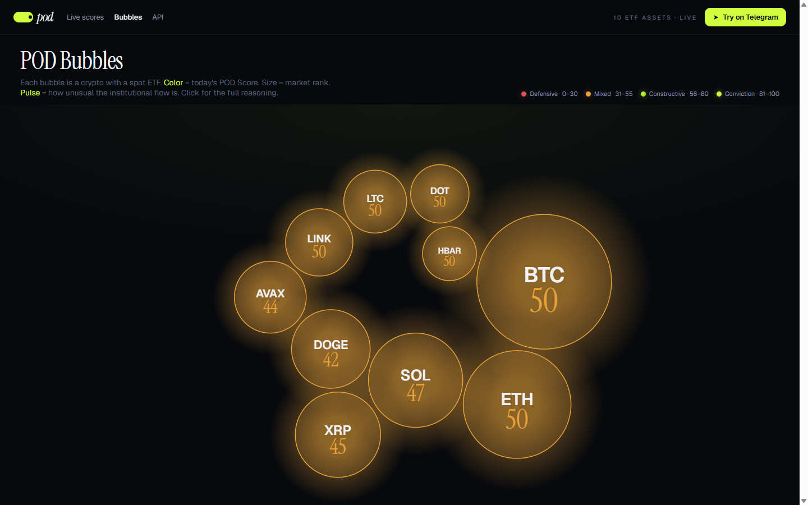
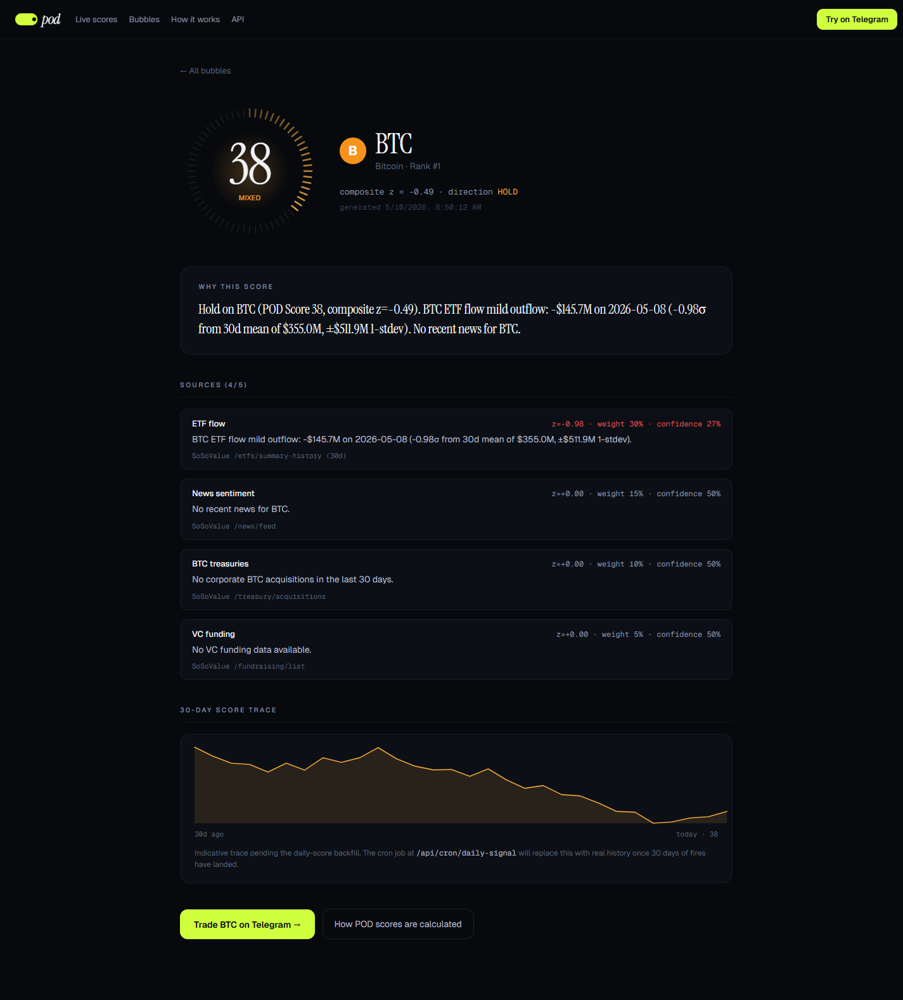
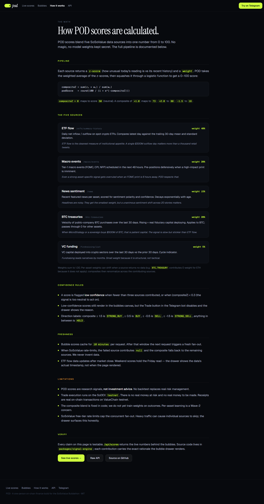

# POD

POD reads the same crypto ETF flow data that big institutions watch, turns it into a single score from 0 to 100 for ten major coins, and explains the reasoning in plain English. You can look at the scores on a web dashboard or get them in Telegram. From Telegram you can also place a test trade based on a score.

**Live**

| | |
|---|---|
| Web — bubble dashboard | https://pod-app-phi.vercel.app/bubbles |
| Web — how scoring works | https://pod-app-phi.vercel.app/how-it-works |
| Web — per-coin detail | https://pod-app-phi.vercel.app/asset/BTC |
| Telegram bot | https://t.me/podttest_bot |
| Public scores API (JSON) | https://pod-app-phi.vercel.app/api/scores |

Built with the SoSoValue API, the SoDEX trading API, and ValueChain (an EVM-compatible chain). Made for the SoSoValue Buildathon.

---

## What problem this solves

When a spot Bitcoin or Ethereum ETF takes in or loses hundreds of millions of dollars in a day, that tells you something about how serious investors are positioned. A research desk at a fund watches this every morning. Most retail traders never see it, or see it too late, or do not know how to read it.

POD does three things:

1. **Reads the data** — pulls ETF flows, macro events, news, corporate Bitcoin holdings, and venture funding from SoSoValue.
2. **Scores it** — combines those five inputs into one POD Score per coin, with a written explanation that points at the exact numbers behind it.
3. **Lets you act on it** — the same scores show up in a Telegram bot, where you can place a test trade on SoDEX in a couple of taps.

The idea behind the buildathon is "a one-person on-chain finance business." POD is the signal-to-execution piece of that: research in, a clear call out, and a way to act — all running with no team and no app to install.

---

## Who it is for

- A crypto trader who wants the institutional read on the ten coins that have spot ETFs, without paying for a Bloomberg terminal.
- Someone who lives in their group chats and would rather get a signal in Telegram than open another website.
- A builder who wants the scores as a clean JSON feed — `GET /api/scores` returns everything.

---

## How a POD Score is built

Each of the five sources returns two things: a **z-score** (how unusual today's reading is compared to its recent history) and a **weight** (how much that source counts). POD takes the weighted average of the z-scores and squashes it into a 0–100 number with a logistic curve.

```
compositeZ = sum(z_i * w_i) / sum(w_i)
podScore   = round(100 / (1 + e^(-compositeZ)))
```

A composite of 0 maps to a score of 50 (neutral). +1.0 maps to about 73. -1.5 maps to about 18.

| Source | Weight | What it measures |
|---|---|---|
| ETF flow | 40% | Daily net inflow or outflow on spot crypto ETFs, compared with the trailing 30-day average and standard deviation. |
| Macro events | 20% | Whether a big macro print (FOMC, CPI, jobs) is scheduled in the next 48 hours. If one is, the score leans defensive. |
| News sentiment | 15% | Recent featured news for the coin, scored for tone. Older news counts less. |
| BTC treasuries | 20% | How fast public companies have been buying Bitcoin in the last 30 days. Applies to BTC; passes through zero for other coins. |
| VC funding | 5% | How much venture money went into crypto in the last 30 days versus the 30 days before. A slow, structural signal. |

The full method is documented on the site at [`/how-it-works`](https://pod-app-phi.vercel.app/how-it-works) — nothing is hidden behind a model.

A score is marked **low confidence** when fewer than three sources returned data, or when the composite is too close to zero to act on. When the SoSoValue free tier rate-limits a source, that source contributes nothing for that run, and the composite falls back to the rest. POD never makes up data — if a source is missing, the explanation says so.

---

## The interfaces

### Web — bubble dashboard

Ten coins, ten bubbles. Colour is the POD Score (red is defensive, lime is conviction). Size is market rank. Click any bubble and a drawer opens with the score, the plain-English reasoning, and a per-source breakdown showing each source's z-score, weight, and one-line rationale. From the drawer you can open the full per-coin page or jump to Telegram.

The dashboard works on a phone — the drawer becomes a bottom sheet. There is a keyboard-reachable list of all ten coins under the canvas for screen readers, and the animation respects the "reduce motion" setting.



### Web — per-coin detail (`/asset/[symbol]`)

A full page for one coin: the score gauge, the reasoning, every source contribution with its citation (for example `SoSoValue /etfs/summary-history (30d)`), the target basket, and a 30-day score trace. The trace is an indicative line for now and is labelled as such — see Limitations.



### Web — how scoring works (`/how-it-works`)

The math, the source weights, the confidence rules, the freshness rules, and an honest limitations section. This page exists so a reviewer or a user can check the work.



### Telegram bot

| Command | What it does |
|---|---|
| `/start` | Short intro, then pick a risk profile (Chill / Balanced / Send it). |
| `/signal` | Full BTC analysis card plus a short AI-written explanation. |
| `/score BTC` | One-line score and reasoning for a coin. |
| `/trade` | Shows a confirmation card — "Buy $6 of BTC at market, based on POD Score N" — with Confirm and Cancel buttons. On Confirm, POD places a real order on the SoDEX testnet and reports the result. Non-BUY directions stop before the card with an explanation. |
| `/lang` | Switch the bot language (English / Chinese / Japanese / Korean). |
| `/help` | List the commands. |

The bot and the web dashboard read the same cached scores, so a number you see in `/score BTC` matches what you see on `/bubbles` and in `/api/scores`.


---

## On-chain

The project's contracts are deployed on the ValueChain testnet (chain ID 138565):

| Contract | Address | Deploy transaction |
|---|---|---|
| `ReasoningLogger` | `0x0723dc7D775864ec08797e84d2A5E068876B221B` | `0xf1af47cc601540bf42a173492cbfc7e8677a7911070a414137d7396b9d04e669` |
| `DrawdownGuard` | `0xaB318f90a8EB8dce770f7B39D5F1175c07706B83` | `0xf76de924d1e52cf340dcd07802151df69cfa427cd9d779e6794217eb5d60c41b` |

Deployer: `0x85987DE711B660d2452AA80D4cBfb2b18981CaaB`. Check the code is there:

```bash
cast code 0x0723dc7D775864ec08797e84d2A5E068876B221B \
  --rpc-url https://testnet-rpc.valuechain.xyz
```

`ReasoningLogger` is meant to anchor a hash of each score's underlying data on chain, so a score POD quotes can be checked later. `DrawdownGuard` enforces a drawdown cap for the vault design. To build the contracts yourself, run `forge install` first inside `packages/pod-contracts` (the OpenZeppelin and forge-std libraries are not vendored), then `forge test`.

A note on getting native gas for the deploy: the SoDEX testnet faucet only drips USDC, not the native SOSO needed to pay gas. We got around it by buying WSOSO on the SoDEX spot market and then using the `transferAsset` endpoint (`type=2`, `toAccountID=999` — `EVM_WITHDRAW`) to move it to the deployer wallet as native gas. The script is at `apps/pod-web/scripts/withdraw-wsoso-to-evm.mts`.

---

## Run it locally

You need Node 20+ and pnpm 9+.

```bash
git clone https://github.com/Pratiikpy/pod.git
cd pod

pnpm install
pnpm --filter @pod/sosovalue-sdk build
pnpm --filter @pod/sodex-sdk build
pnpm --filter @pod/signal-engine build

# copy the env template and fill in at least SOSOVALUE_API_KEY
cp .env.example apps/pod-web/.env.local
# then edit apps/pod-web/.env.local

# run the web app
pnpm --filter @pod/pod-web dev
# open http://localhost:3000/bubbles

# run the bot in a second terminal (needs TELEGRAM_BOT_TOKEN)
pnpm --filter @pod/pod-bot dev
```

Environment variables that matter:

| Variable | Needed by | Effect if missing |
|---|---|---|
| `SOSOVALUE_API_KEY` | web, bot | The dashboard and bot fall back to neutral placeholder scores and say so. |
| `TELEGRAM_BOT_TOKEN` | bot | The bot will not start. |
| `SODEX_PRIVATE_KEY` | bot `/trade` | `/trade` replies that execution is not configured. |
| `NVIDIA_API_KEY` | bot | The bot uses template explanations instead of AI-written ones. |
| `DEPLOYER_PRIVATE_KEY`, `VALUECHAIN_TESTNET_RPC` | contract deploy | Skipped. |

The repo also ships a one-shot `deploy.sh` that runs the tests, builds the SDKs, deploys the contracts (if the deployer wallet has gas), and deploys the web app.

---

## How to check it works (for a reviewer, ~5 minutes)

1. Open https://pod-app-phi.vercel.app/bubbles. The first load can take about 30 seconds — it fetches all ten coins across five sources, then caches the result for 10 minutes. You should see ten bubbles with different scores, not all the same number.
2. Click a bubble. The drawer shows the score, the reasoning, and a "Sources (N/5)" panel with the per-source breakdown. Click "View full analysis" for the per-coin page.
3. Open https://pod-app-phi.vercel.app/api/scores in a browser. Same numbers, raw JSON, with a `generated_at` timestamp.
4. Open https://t.me/podttest_bot and send `/score BTC`. The score should match what you saw on the web. Send `/signal` for the full card. Send `/trade` to see the confirmation flow.
5. Read https://pod-app-phi.vercel.app/how-it-works for the method, and run the `cast code` command above to confirm the contracts are deployed.

Everything is reproducible: the scoring code is in `packages/signal-engine`, the API responses are open, and the on-chain addresses are listed above.

---

## How this maps to the judging criteria

**User value and practical impact.** POD takes data that real desks use — ETF flows, macro calendar, corporate Bitcoin holdings — and turns it into one number with a reason attached. A trader gets the institutional read on the ten ETF coins for free, in the place they already spend time, and can act on it with a confirm step. The risk profile changes how trades are sized.

**Functionality and working demo.** There are four working surfaces: the web dashboard, the per-coin pages and the methodology page, the Telegram bot with `/signal` `/score` `/trade`, and the deployed contracts on ValueChain testnet. The public `/api/scores` endpoint is live. None of the core flow is mocked.

**Logic, workflow, and product design.** The score is a documented weighted z-score across five sources, not a black box. Every claim in the UI links to the source data. `/trade` has a confirmation gate before any order goes out. There is a freshness rule and a low-confidence rule, both visible to the user. The bot and web share one cached signal so numbers never disagree.

**Data and API integration.** POD uses the SoSoValue API across ETF flows, macro events, news, BTC treasuries, and fundraising. It uses the SoDEX API for spot symbols, account state, and signed (EIP-712) order placement. It uses ValueChain for the deployed contracts. The `transferAsset` endpoint is used to move WSOSO out of the SoDEX ledger to fund deployment gas.

**UX and clarity.** The bubble dashboard is the front door — colour, size, and a click for the why. The interface is responsive, the drawer becomes a bottom sheet on mobile, there is a keyboard-and-screen-reader fallback, and loading and error states are handled honestly rather than hidden. First useful screen in under a minute.

---

## What is not done yet (honest list)

- **`/trade` uses one shared wallet.** Right now the bot signs every test trade with a single `SODEX_PRIVATE_KEY` set on the server. That is custodial, and it is fine for a testnet demo where nothing has value, but it is not how a real product should work. The intended design is an embedded wallet per user (Privy or similar) so each person signs their own trades and POD never holds keys. That is the next step.
- **`/trade` depends on the testnet venue state for the coin.** The demo wallet is authorised to trade — it has placed real orders on SoDEX testnet (for example a `SOSO/USDC` market buy that came back with an order ID). But the `BTC/USDC` pair on the testnet intermittently goes into "cancel only mode", and `TESTBTC/USDC` sometimes reports `MissingOraclePrice`. When that happens, `/trade` builds the order, signs it (EIP-712), and submits it — and the bot reports back exactly which venue state it hit. So whether a `/trade` on BTC fills depends on what state the testnet pair is in at that moment, not on any account permission.
- **No score history database yet.** The 30-day trace on the per-coin page is an indicative line, not real history. The daily cron job (`/api/cron/daily-signal`) is set up to record scores; once it has run for a month the trace will be real. Persisting to a real database (Postgres on the Vercel marketplace) is on the list.
- **The composite weights are fixed in code.** POD does not yet learn the weights from outcomes — there is no backtest loop tuning them. The weights are a reasonable starting point, not a trained model.
- **SoSoValue free-tier rate limits.** On a busy run, individual sources can get rate-limited and skip. The drawer shows this with the "Sources (N/5)" count, and the score falls back to the sources that did return. We do not pretend the missing data is there.
- **Testnet only.** Every trade is on the SoDEX testnet. The on-chain receipts are real transactions on the ValueChain testnet, not mainnet. There is no real money at risk and none to be made.
- **Reasoning is English-first.** The bot has four languages for its UI text, but the AI-written explanations are generated in English. Translating the reasoning itself is later work.

These are tracked, not swept under the rug. The README and the `/how-it-works` page both say the same thing.

---

## Tech stack

- **Web** — Next.js 15 (App Router), React, server components, deployed on Vercel. Two daily cron jobs.
- **Bot** — grammY on a Vercel function, webhook-based.
- **Signal engine** — a TypeScript package that turns raw SoSoValue data into a `PodSignal` (score, composite z, per-source contributions, plain-English reasoning, target basket). It has a batch mode that fetches the global sources once and reuses them across all ten coins, so the fan-out stays under the free-tier rate limit.
- **SoSoValue SDK** — a typed client over the SoSoValue API with Zod schemas; rate-limit errors are surfaced as typed exceptions so the engine can decide what to do.
- **SoDEX SDK** — a typed client over the SoDEX spot and perps APIs, including the EIP-712 signing ported from the official Go SDK.
- **Contracts** — Foundry. `ReasoningLogger`, `DrawdownGuard`, and a `PodVault` design.

## Repo layout

```
pod/
├── apps/
│   ├── pod-web/          Next.js app — /bubbles, /asset/[symbol], /how-it-works, /api/scores, cron jobs, Telegram webhook
│   ├── pod-bot/          grammY bot logic (also bundled into the pod-web webhook route)
│   └── pod-workers/      background job scaffolding (signal poller, rebalancer)
├── packages/
│   ├── sosovalue-sdk/    typed SoSoValue API client
│   ├── sodex-sdk/        typed SoDEX API client + EIP-712 signing
│   ├── signal-engine/    the five-source scoring engine
│   ├── pod-shared/       shared types and helpers
│   └── pod-contracts/    Foundry contracts and deploy script
├── docs/
│   ├── ARCHITECTURE.md   how the pieces fit together
│   └── images/           screenshots used in this README
├── deploy.sh             one-shot: test → build SDKs → deploy contracts → deploy web
├── vercel.json           Vercel build configuration
└── .env.example          environment variable template
```

## License

MIT. Built by one person for the SoSoValue Buildathon — leaning into the "one-person on-chain finance business" idea on purpose.
