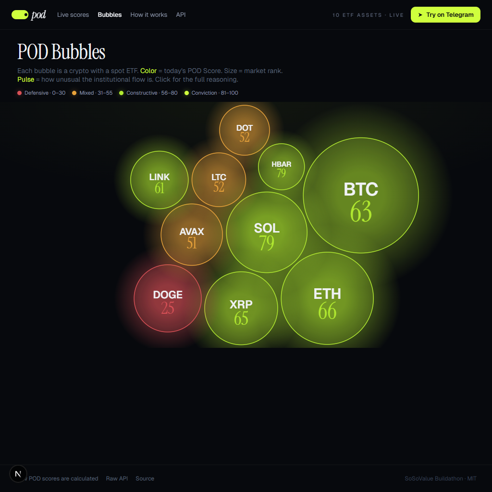
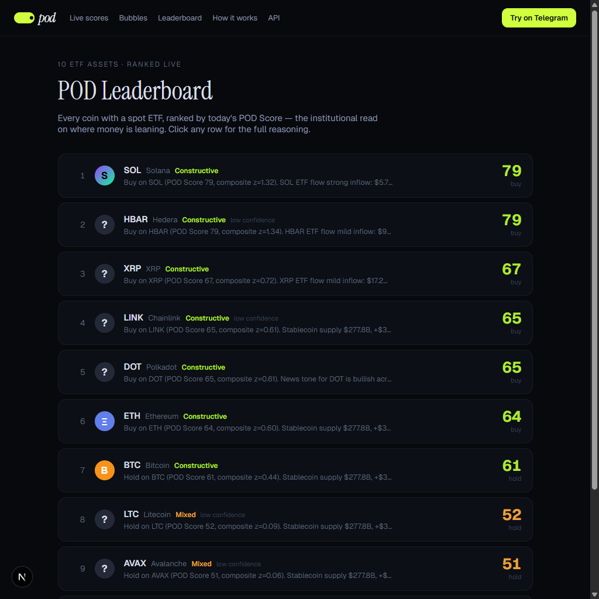
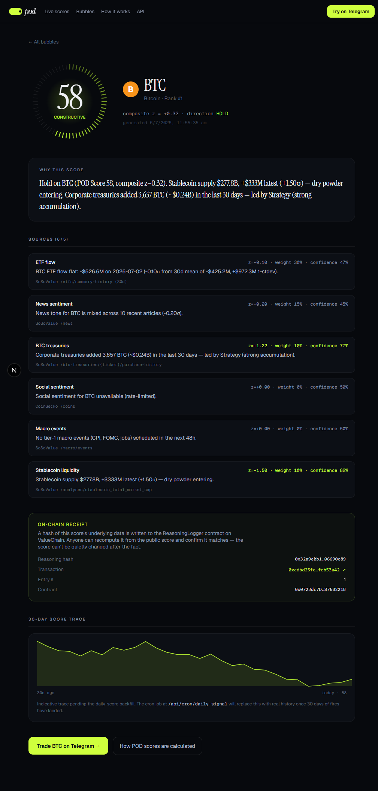
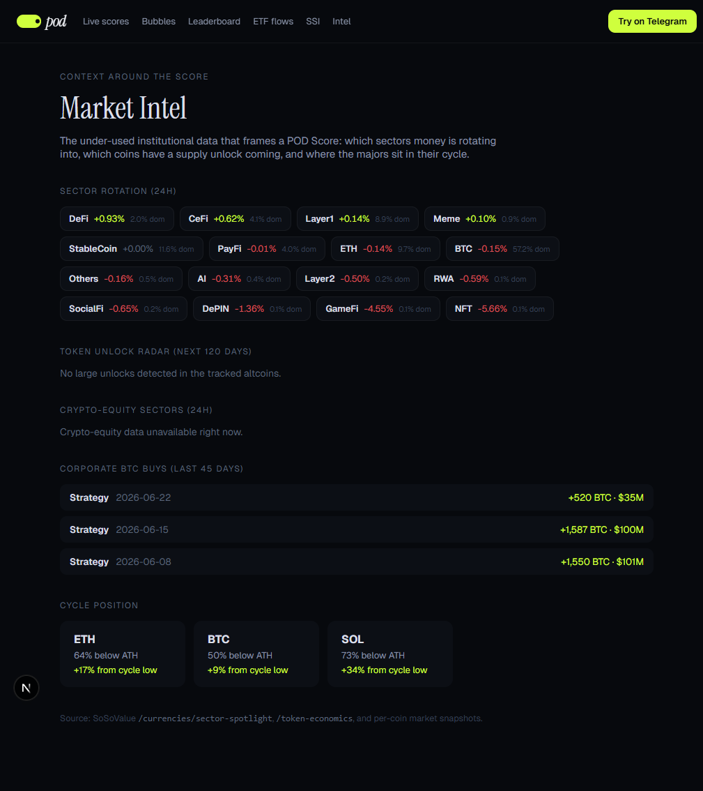
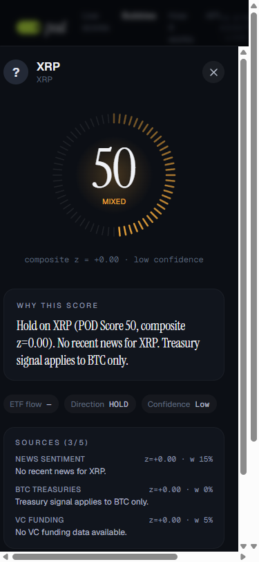

# POD

*Institutional ETF-flow scores for crypto — a signal-to-execution platform on a web dashboard and in Telegram.*

POD reads the same crypto ETF flow data that institutional desks watch every morning, fuses it with five other institutional signals into a single score from 0 to 100 for ten major coins, and explains the reasoning in plain English with every number cited. You read the scores on a web dashboard, ask about them in a Telegram bot, and act on them in one tap — a market order on the SoDEX testnet, or a take-profit, DCA schedule, or limit ladder. Every score is hash-anchored on-chain so it can be verified after the fact.

**▶ Watch the 2-minute demo:** https://youtu.be/cn1l-CzNZhQ — the full web tour plus the Telegram signal-to-execution flow (a live SoDEX testnet order).

[](https://youtu.be/cn1l-CzNZhQ)

**Live**

| Surface | URL |
|---|---|
| Web — bubble dashboard | https://pod-app-phi.vercel.app/bubbles |
| Web — leaderboard | https://pod-app-phi.vercel.app/leaderboard |
| Web — ETF flow table | https://pod-app-phi.vercel.app/flows |
| Web — SSI index co-pilot | https://pod-app-phi.vercel.app/ssi |
| Web — market intel | https://pod-app-phi.vercel.app/intel |
| Web — per-coin detail | https://pod-app-phi.vercel.app/asset/BTC |
| Web — how scoring works | https://pod-app-phi.vercel.app/how-it-works |
| Web — track record | https://pod-app-phi.vercel.app/track-record |
| Web — developer API | https://pod-app-phi.vercel.app/developers |
| Web — connect / QR | https://pod-app-phi.vercel.app/connect |
| Telegram bot | https://t.me/podttest_bot |
| Public scores API (JSON) | https://pod-app-phi.vercel.app/api/scores |
| MCP server (agent tools) | https://pod-app-phi.vercel.app/api/mcp |

Built with the SoSoValue API, the SoDEX trading API, ValueChain (an EVM-compatible L1), CoinGecko, and the 0G AI model. Made for the SoSoValue Buildathon.

---

## What problem this solves

When a spot Bitcoin or Ethereum ETF takes in or loses hundreds of millions of dollars in a day, that says something about how serious money is positioned. A research desk at a fund watches this every morning. Most retail traders never see it, see it too late, or don't know how to read it.

POD does three things:

1. **Reads the data** — ETF flows, macro calendar, coin-tagged news, corporate Bitcoin accumulation, stablecoin liquidity, and social sentiment, from SoSoValue and CoinGecko.
2. **Scores it** — a documented weighted z-score across those six sources, one POD Score per coin, with a written explanation that points at the exact numbers behind it, and an honest low-confidence flag.
3. **Lets you act on it** — the same scores show up in a Telegram bot with an auto-generated in-bot wallet, one-tap orders on SoDEX, take-profit/stop-loss, DCA, alerts, and a shareable everything.

The buildathon's theme is "a one-person on-chain finance business." POD is the signal-to-execution piece of that: data in, a clear call, a way to act on it, and on-chain proof — running with no team and no app to install.

---

## How a POD Score is built

Each source returns a **z-score** (how unusual today's reading is versus its recent history) and a **weight** (how much it counts). POD takes the weighted average of the z-scores and maps it to a 0–100 number through a logistic curve.

```
compositeZ = sum(z_i * w_i) / sum(w_i)
podScore   = round(100 / (1 + e^(-compositeZ)))
```

A composite of 0 maps to a score of 50 (neutral). +1.0 maps to about 73. −1.5 maps to about 18.

| Source | Weight | What it measures |
|---|---|---|
| ETF flow | 0.30 | Daily net inflow/outflow on spot crypto ETFs, z-scored against the trailing 30-day distribution. |
| Macro events | 0.15 | A tier-1 macro release (CPI, FOMC, jobs) in the next 48h leans the score defensive; silent otherwise. |
| News sentiment | 0.15 | Recency-weighted tone of coin-tagged SoSoValue news over the last few days. |
| BTC treasuries | 0.10 | 30-day corporate BTC accumulation across the largest public holders. BTC only. |
| Stablecoin liquidity | 0.10 | Z-score of the change in total stablecoin supply — the "dry powder" tide. |
| Social sentiment | 0.07 | CoinGecko per-coin crowd vote — the fast retail counterweight to the slow institutional sources. |

Weights are normalised by their sum, so a source with no data contributes nothing rather than dragging the score to neutral. A score is marked **low confidence** when fewer than three sources returned a weighted contribution, or when the composite is too close to zero to act on. When a source is rate-limited or empty, it contributes nothing and the explanation says so — POD never invents data. Full method: [`/how-it-works`](https://pod-app-phi.vercel.app/how-it-works).



---

## The web surfaces

- **Bubbles** (`/bubbles`) — ten coins, ten bubbles. Colour is the score (red defensive, lime conviction), size is rank, pulse is how unusual the flow is. Click for a drawer with the full reasoning and per-source breakdown. Responsive; mobile bottom-sheet; keyboard/screen-reader list; respects reduce-motion.
- **Leaderboard** (`/leaderboard`) — all ten ranked by score with the one-line why.
- **ETF flows** (`/flows`) — a Farside-style table of daily per-asset net creations/redemptions, green in / red out, with a 7-day net column.
- **SSI co-pilot** (`/ssi`) — SoSoValue's thirteen SSI index baskets ranked by momentum with their ROI ladder, the ones tradable on SoDEX flagged, and the featured basket's constituents.
- **Market intel** (`/intel`) — sector rotation, token-unlock radar, cycle position (down-from-ATH / up-from-cycle-low), crypto-equity sectors, and a corporate BTC-buy feed.
- **Per-coin** (`/asset/[symbol]`) — score gauge, reasoning, every source contribution with its citation, target basket, real score trace, and an **on-chain receipt** (the reasoning hash + the ValueChain tx that anchored it). Each page ships a shareable OG card.
- **Track record** (`/track-record`) — how many scores are recorded and anchored on-chain; honest hit-rate accrues over time, no cherry-picking.
- **Developers** (`/developers`) + **Connect** (`/connect`) — the open API, a scannable QR into the bot, deep links, and an embeddable live score badge.





---

## The Telegram bot

Auto-generates an in-bot ValueChain wallet on `/start` (private key encrypted at rest, AES-256-GCM) so a new user is trading in ~30 seconds — no external wallet.

| Command | What it does |
|---|---|
| `/start` | Intro + risk profile; mints your in-bot wallet. Handles deep links (`?start=score-BTC`, `?start=ref-<id>`). |
| `/score BTC` | One-line score + reasoning, with one-tap **Buy $5 / $10** buttons on constructive coins. |
| `/signal` | Full BTC card + an AI-written explanation. |
| `/ask <question>` | Natural-language Q&A answered **only** from live POD data, with citations (0G AI). |
| `/trade` | Confirm card → real EIP-712-signed SoDEX testnet order, result reported back. |
| `/tp BTC 70000 60000` | Server-side take-profit / stop-loss; a monitor exits when a level is hit. |
| `/dca BTC 5` | Recurring buy on a schedule. |
| `/ladder BTC 20` | A batch of limit buys stepped below the orderbook. |
| `/safety` | Dead-man switch — auto-cancels resting orders after N minutes. |
| `/alert BTC above 70` | Ping when a score crosses; also POSTs to your `/webhook` URL. |
| `/watch` · `/watchlist` | Personal watchlist for the daily digest. |
| `/wallet` · `/portfolio` | Your wallet + balance; the demo trading wallet's holdings. |
| `/import` · `/export` | Bring your own wallet / reveal your key. |
| `/pro` · `/ref` · `/webhook` | Freshness tier, referral link, event webhook. |
| `/lang` · `/help` | Language (EN/中文/日本語/한국어), commands. |
| inline mode | Type `@podttest_bot BTC` in **any** chat to drop a live score card. |

The bot and web read the same 10-minute cached scores, so `/score BTC` matches `/bubbles` and `/api/scores`.



---

## On-chain

Contracts on the ValueChain testnet (chain ID 138565):

| Contract | Address |
|---|---|
| `ReasoningLogger` | `0x0723dc7D775864ec08797e84d2A5E068876B221B` |
| `DrawdownGuard` | `0xaB318f90a8EB8dce770f7B39D5F1175c07706B83` |

**`ReasoningLogger` is now written to.** The daily job anchors a `keccak256` of each score's canonical data on-chain and stores the tx. A per-coin page shows the receipt; `GET /api/receipt/BTC` returns the hash, tx, and explorer link. Anyone can recompute the hash from the public score and confirm it matches. `DrawdownGuard` holds the per-profile max-drawdown caps (Chill 5% / Balanced 10% / Send-it 20%) for the vault design.

```bash
cast code 0x0723dc7D775864ec08797e84d2A5E068876B221B --rpc-url https://testnet-rpc.valuechain.xyz
```

Note on gas: the SoDEX testnet faucet drips USDC, not the native SOSO for gas. The workaround was to buy WSOSO on the SoDEX spot market and `transferAsset` (`type=EVM_WITHDRAW`, `toAccountID=999`) it to the deployer as native gas. Trading itself is gasless (off-chain EIP-712), so users never need native gas.

---

## Run it locally

Node 22+ and pnpm 10+ (pinned `pnpm@10.32.1`).

```bash
git clone https://github.com/Pratiikpy/pod.git
cd pod
pnpm install
pnpm --filter @pod/sosovalue-sdk build
pnpm --filter @pod/sodex-sdk build
pnpm --filter @pod/signal-engine build

cp .env.example apps/pod-web/.env.local   # then fill it in
pnpm --filter @pod/pod-web dev            # http://localhost:3000/bubbles
```

The bot runs as a webhook route inside the web app (`/api/telegram`) — no separate process. Point Telegram at it with `setWebhook`.

Environment variables:

| Variable | Needed by | Effect if missing |
|---|---|---|
| `SOSOVALUE_API_KEYS` | scores | Comma-separated key pool (round-robin + 429 failover); the 10-coin fan-out exceeds one key's 20/min. Falls back to `SOSOVALUE_API_KEY`. Without any, scores fall back to neutral and say so. |
| `DATABASE_URL` | history, wallets, alerts, DCA, watchlist, referrals | Postgres (Neon free tier). Without it, those features no-op. |
| `TELEGRAM_BOT_TOKEN` | bot | The bot won't respond. |
| `SODEX_PRIVATE_KEY` | `/trade`, presets, TP/SL, DCA | Execution disabled. |
| `WALLET_ENCRYPTION_KEY` | in-bot wallets | 32-byte hex; without it, wallet features off. |
| `OG_API_KEY` | `/ask`, narration | 0G AI (OpenAI-compatible); NVIDIA is the fallback, then templates. |
| `COINGECKO_API_KEY` | social source | Optional demo key; without it the free tier rate-limits the 10-coin burst (works for ~5). |
| `DEPLOYER_PRIVATE_KEY`, `VALUECHAIN_TESTNET_RPC` | on-chain logging | Falls back to `SODEX_PRIVATE_KEY` + a default RPC. |

---

## How to check it works (~5 minutes)

1. Open [`/bubbles`](https://pod-app-phi.vercel.app/bubbles). Ten bubbles, **different** scores (not all 50). Click one → drawer with reasoning + a "Sources (N/6)" breakdown.
2. Open [`/api/scores`](https://pod-app-phi.vercel.app/api/scores) → same ten scores as JSON with a fresh `generated_at`.
3. Open [`/asset/BTC`](https://pod-app-phi.vercel.app/asset/BTC) → scroll to **On-chain receipt**; the tx link opens on the ValueChain explorer.
4. In [the bot](https://t.me/podttest_bot): `/score BTC` (matches the web), `/ask which coin is most bearish and why`, `/wallet`, and tap **Buy $5** on a constructive `/score` — a real SoDEX order ID comes back.
5. Type `@podttest_bot BTC` in any chat to see inline mode; hit [`/api/mcp`](https://pod-app-phi.vercel.app/api/mcp) to see the agent tools.

---

## How this maps to the judging criteria

- **User value & practical impact (30%)** — the institutional read on the ten ETF coins for free, plus market intel (sector rotation, unlocks, cycle, corporate buys), an AI you can ask, and one-tap execution with TP/SL, DCA, and alerts.
- **Functionality & working demo (25%)** — ten web surfaces, ~20 bot commands + inline mode, real SoDEX order IDs, on-chain receipts, an MCP server — none of the core flow is mocked, all verified end-to-end.
- **Logic, workflow & product design (20%)** — a documented six-source weighted z-score, every claim cited, confirm-gated trades, honest low-confidence, and one shared cache so web/bot/API never disagree.
- **Data & API integration (15%)** — SoSoValue across ETF flow, macro, news, treasuries, fundraising, indices/SSI, sector-spotlight, token-economics, stablecoin analyses, and per-coin snapshots + order-book depth; SoDEX spot (market/limit/batch/cancel/schedule-cancel) with EIP-712 signing; CoinGecko social; ValueChain contracts.
- **UX & clarity (10%)** — the bubble front door, consistent nav, share cards, QR + deep links, and honest loading/empty/error states.

---

## Proven demand — every feature maps to a product that validated it

None of POD's features are speculative. Each one copies a pattern already proven at scale by a real product with real users, revenue, or engagement — then applies it to institutional ETF-flow data and on-chain execution.

| POD feature | Who proved the demand | The evidence |
|---|---|---|
| **In-bot wallet on `/start`** (F11) | Trojan, Maestro, Banana Gun, BONKbot | 500k+ users each; auto-generated custodial wallet is the #1 onboarding conversion lever — trade in ~30s, no external wallet. |
| **One-tap preset orders** (F12) | Every top Telegram bot | Preset buy/sell buttons are the universal speed win; Telegram bots drove ~$23.4B of 2025 crypto volume. |
| **Server-side TP/SL** (F13) | Trojan | Auto-sell that runs with Telegram closed is the #1 retention feature — keeps positions and money in the product. |
| **Score-triggered alerts** (F15) | Whale Alert, Nansen Smart Alerts, CryptoQuant | Whale Alert's pure alert feed has **310k** Telegram subscribers; alerts are the universally-paid daily-use primitive. |
| **`/ask` grounded Q&A** (F16) | aixbt Terminal, Bankr, Messari Copilot | Conversational "ask the agent" is the most-used AI pattern; Messari grounds every answer in cited data (POD does the same — no invented numbers). |
| **DCA schedules** (F17) | Trojan / Maestro DCA, 3Commas | "Set a rule, let it run" is proven retail behaviour. |
| **Portfolio / PnL view** (F18) | Every bot's daily surface; CoinStats/Delta (multi-million users) | Portfolio is the daily-open hook. |
| **Shareable score cards + inline mode** (F20, F43) | Trojan/BONKbot PnL cards; Stripe payment links, Cash App `$cashtag` | Shareable artifacts are the free viral loop; inline mode drops a live score into any group chat with no install. |
| **Composite score + leaderboard** (F1, F2) | Kaito "Mindshare", Nansen "Smart Money" | One branded proprietary number becomes the daily-open hook and the thing people quote. |
| **Per-issuer ETF flow table** (F21) | Farside Investors | The single most-screenshotted ETF artifact in crypto; media and traders cite it nightly. |
| **On-chain receipts + track record** (F26, F27) | dHEDGE, Enzyme, Index Coop | Verifiable-on-chain everything is the entire trust model of on-chain asset management; aixbt shows even honest hit-rate earns trust. |
| **SSI index co-pilot** (F24) | Index Coop, Set/TokenSets, SoSoValue SSI | "One token = a whole strategy" is a proven, trusted product. |
| **Market intel** (F6/F7/F8/F9) | Nansen, Messari, Santiment, Arkham | Sector rotation, unlock calendars, cycle metrics, and labelled corporate flows are what users pay for daily. |
| **MCP server + open API** (F29, F30) | DeFiLlama, Glassnode (MCP), Kaiko, Messari | The API/agent surface is a core revenue + credibility line and matches the "agent-friendly" ValueChain theme. |
| **Webhooks** (F31) | TradingView alerts → webhook → bot | The canonical "signal → action" bridge retail already understands. |
| **Referral + fee-share** (F32–34) | Trojan (5-level, 35%), Banana ($BANANA 40% fee share) | The documented primary growth engine of every top bot. |
| **Freshness / Pro tier** (F37) | CryptoQuant, Glassnode, Nansen | A delayed free tier + real-time paid tier is the proven monetization funnel. |
| **Dead-man switch, limit ladder** (F19, F39) | Pro trading tooling (SoDEX `scheduleCancel`, batch orders) | Standard risk/execution primitives that carry the "risk control" judging bonus. |
| **Embed badge + QR/connect** (F46, F49) | Stripe buy-button, TradingView widgets, bot deposit QRs | Frictionless distribution surfaces. |

One honest caveat POD keeps front-and-centre: ETF flow is a **lagging, medium-term** signal (Farside, CoinGlass). POD frames the score as institutional-demand *context* with an explicit confidence flag — honesty is itself a trust feature, and it carries the risk-control judging bonus.

The full research behind this — competitor-by-competitor, with sources — is in [`docs/POD_MASTER_PLAN.md`](docs/POD_MASTER_PLAN.md).

---

## What is not done yet

- **Trading uses one shared demo wallet.** `/trade` and presets sign with a single server-side `SODEX_PRIVATE_KEY`. Each user gets their own in-bot wallet (and can `/import` one), but trades execute on the shared funded wallet — per-user trading needs each wallet funded, which the testnet faucet doesn't do per-user. Custodial, fine for a testnet demo.
- **Testnet fills depend on venue state.** Orders are placed and signed with real order IDs; whether they fill depends on the SoDEX testnet's thin liquidity and per-pair state (`cancel only`, `MissingOraclePrice`). The bot reports the exact venue result.
- **Perps not funded.** The perps signing domain is fixed (`futures`), but the perps ledger isn't funded, so perps orders aren't demoed. Spot is the demo path.
- **Score history is young.** The trace and hit-rate on `/track-record` accrue as the daily job runs — real, just early.
- **Fixed weights.** The composite weights are a reasoned starting point, not trained on outcomes.
- **No per-user public profile.** Shareable OG cards, the public track record, and connect links exist; a per-user handle profile would need an auth system POD deliberately doesn't have.
- **English-first reasoning.** The bot UI has four languages; the AI explanations are English.

Every limitation is also stated on `/how-it-works`.

---

## Tech stack

- **Web + bot** — Next.js 15 (App Router, server components) on Vercel; the grammY bot is a webhook route inside the app.
- **Signal engine** — a TypeScript package turning raw SoSoValue + CoinGecko data into a `PodSignal`; a batch mode hoists global sources and reuses them across all ten coins under the rate limit.
- **SoSoValue SDK** — a typed, Zod-validated client with a round-robin API-key pool, 429 failover, and a process-wide cache that dedupes the fan-out.
- **SoDEX SDK** — a typed spot/perps client with EIP-712 signing ported from the Go SDK, plus an account WebSocket for fill receipts.
- **Data** — Neon Postgres (scores, wallets, alerts, DCA, TP/SL, watchlist, referrals, webhooks); 0G AI for reasoning; CoinGecko for social.
- **Contracts** — Foundry: `ReasoningLogger`, `DrawdownGuard`, a `PodVault` design.

## Repo layout

```
pod/
├── apps/
│   ├── pod-web/          Next.js app — all web pages, the Telegram webhook,
│   │                     the public + MCP APIs, and the cron jobs
│   ├── pod-bot/          legacy standalone bot (the live bot is the webhook route)
│   └── pod-workers/      background job scaffolding
├── packages/
│   ├── sosovalue-sdk/    typed SoSoValue client (key rotation + cache)
│   ├── sodex-sdk/        typed SoDEX client + EIP-712 signing + WebSocket
│   ├── signal-engine/    the six-source scoring engine
│   └── pod-contracts/    Foundry contracts
├── docs/
│   ├── POD_MASTER_PLAN.md   the full build plan
│   └── images/             screenshots
├── deploy.sh · vercel.json · .env.example
```

## License

MIT. Built by one person for the SoSoValue Buildathon, in the spirit of the "one-person on-chain finance business" theme.
